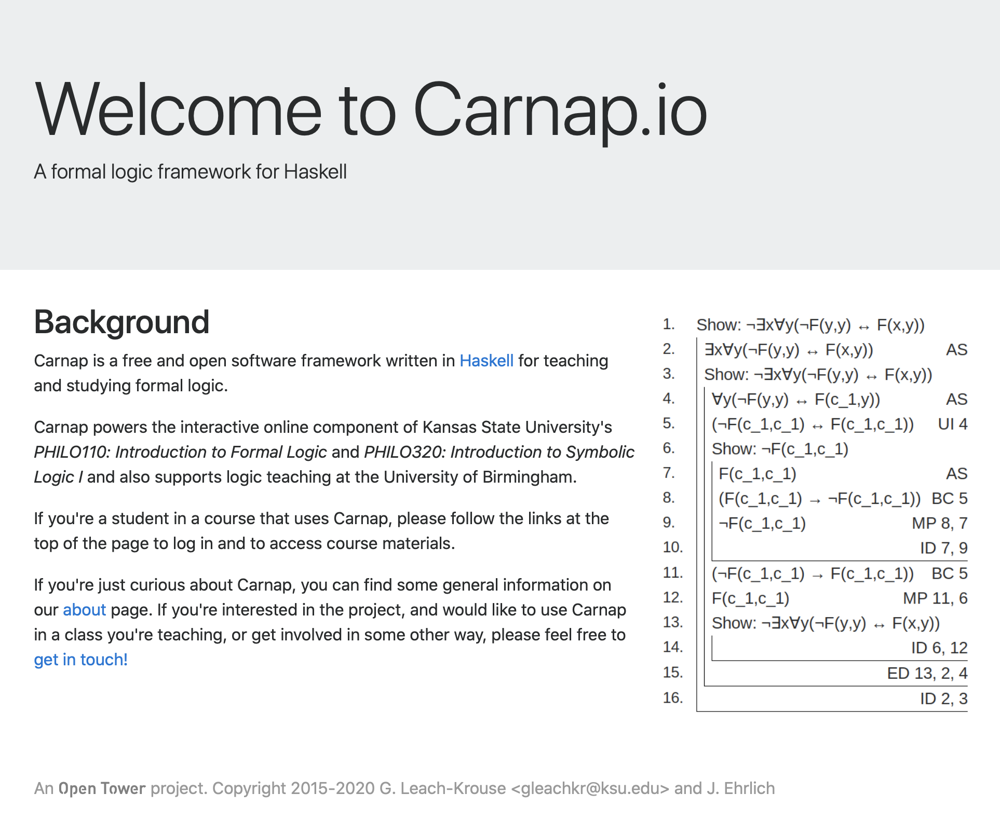
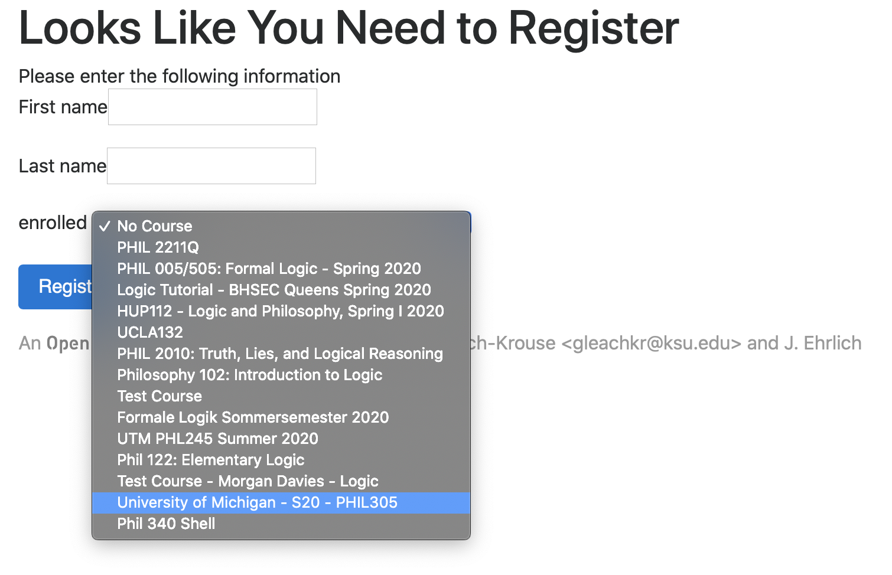
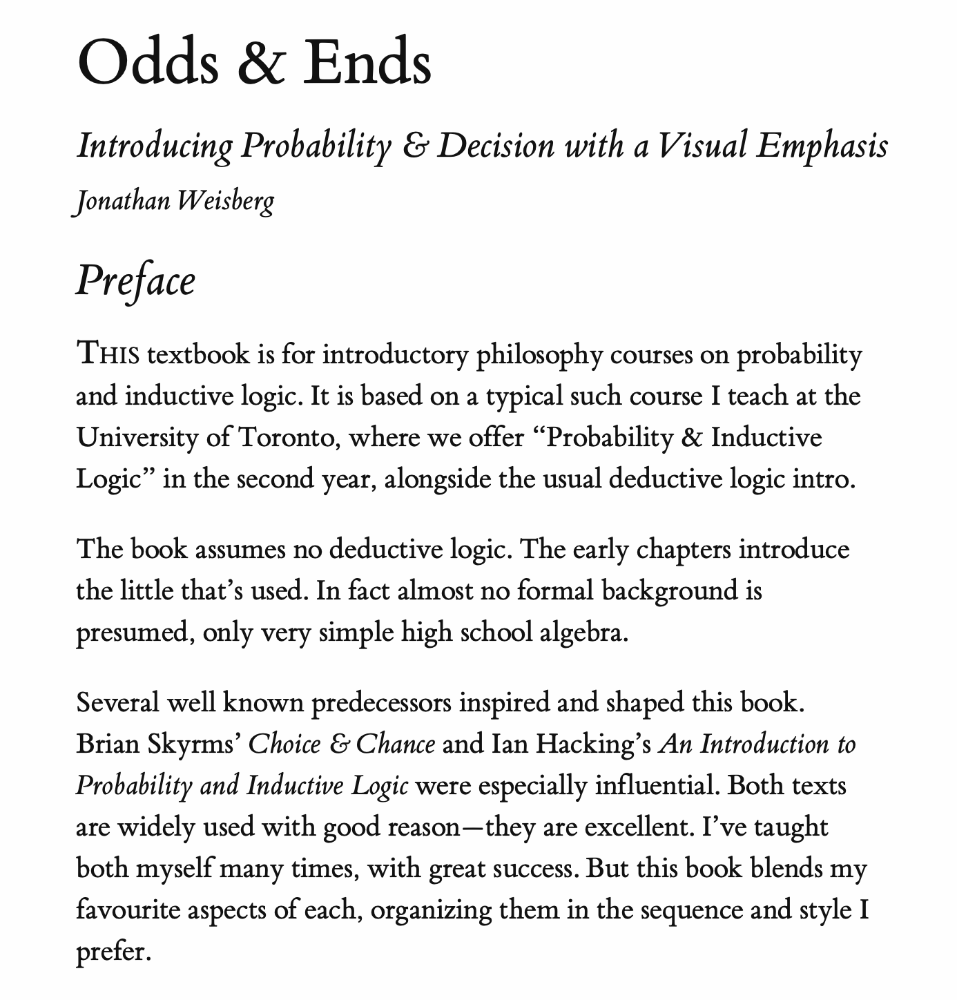
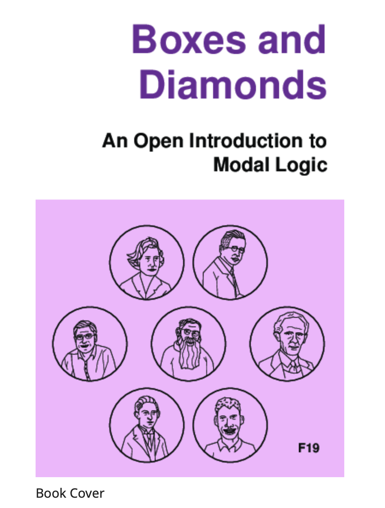
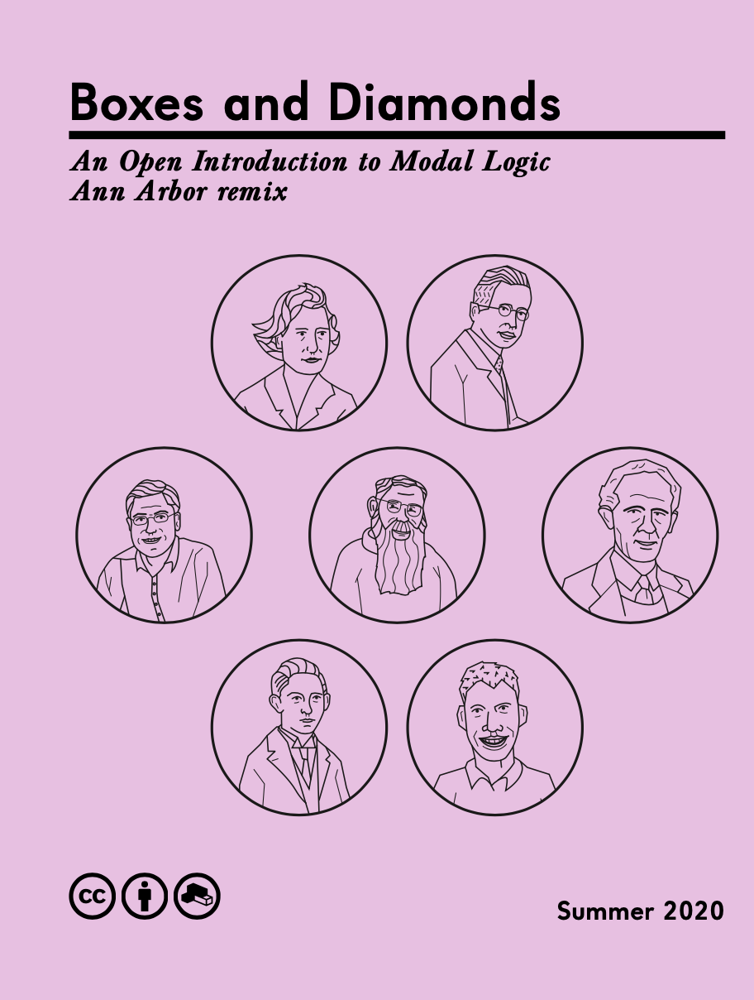

## Aim of Course

Introductory survey of some formal methods that are of broad philosophical use.

## Three Sections

1. Propositional Logic
2. Probability and Statistical Reasoning
3. Modal Logic and Conditionals

## Propositional Logic

> - This is the logic of sentences that can be true or false, and that can combine to form longer sentences. 
> - It is taken for granted in almost any field (outside philosophy) where formal tools are used. 
> - In philosophy we might sometimes want to drop the assumption that everything is either true or false (and not both), but for this course we'll take it for granted.

## Probability and Statistical Reasoning

> - Sometimes we can't infer that a conclusion is definitely true, but we can infer that it is probably true.
> - We will look at some tools for regimenting how and when we make such inference. 

## Modal Logic

This is the logic of 'must' and 'might'.  It has as many applications as there are interpretations of 'must' and 'might'. The primary interpretations we'll look at are:

- Metaphysical 
- Epistemological  
- Moral 

## Textbooks

There are three - all of them available through Canvas.

1. _The Carnap Book_ by Graham Leach-Krouse
2. _Odds and Ends_ by Jonathan Weisberg
3. _Boxes and Diamonds, Ann Arbor remix_

The three books are for the three parts of the course.

## The Carnap Book

{height=80%}

## Registering with Carnap

{height=80%}

---

{height=80%}

## Odds and Ends

{height=80%}

## Boxes and Diamonds

{height=80%}

---

{height=80%}