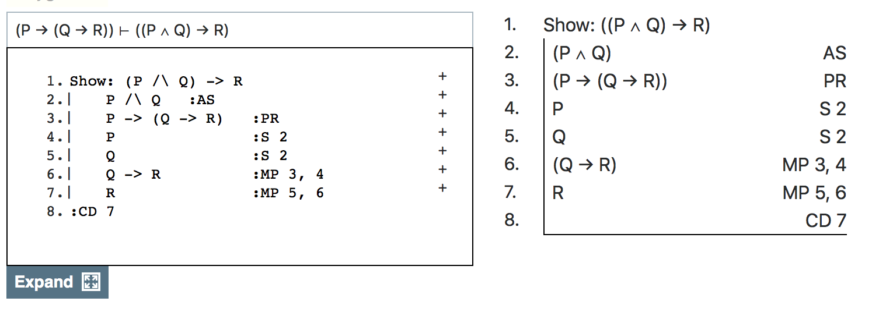
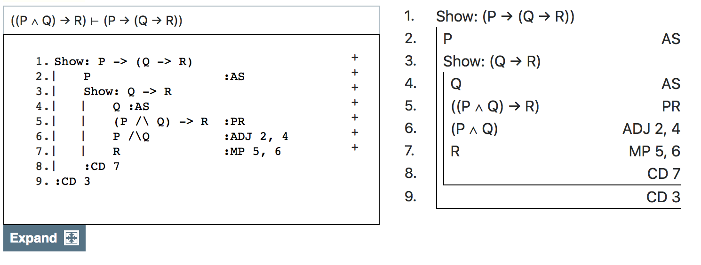

## Plan for Today

We're going to talk about how 'and' behaves in Carnap.

## Associated Reading

Carnap book, chapter 8, Section "Simplification and Adjunction" (about 1/3 of the way down).

## Two Rules for And

The rules for 'and' are really simple; I'm not sure why Carnap doesn't start with them.

## Proving a Conjunction

- If you have a line that says $A$, and another line that says $B$, you can infer $A \wedge B$. (Note that I'm using 'conjunction' to just mean a sentence with 'and' as the main connective.)
- The rule is called 'Adjunction', and abbreviated 'ADJ'.
- You cite the lines that $A$ and $B$ appear on.

## Using a Conjunction

- If you have a line that says $A \wedge B$, you can derive $A$, and you can (separately) derive $B$.
- The rule is called 'Simplification', and abbreviated 'S'.
- You cite the line that $A \wedge B$ appears on.

## A Little More MetaLogic

- I won't go through even an informal proof, but you should convince yourself that these two things are equivalent.

1. $A, B \vdash C$
2. $A \wedge B \vdash C$

## A Translation Exercise

Conditionals intersect with conjunction in an interesting way. To see this, think about how to translate the following sentence.

If we win, and if Michigan State loses, then we're going to the Big Ten Championship Game.

## Question

Using the dictionary

- $P$ = We win
- $Q$ = Michigan State loses
- $R$ = We're going to the Big Ten Championship Game

How would you translate this?

## Two Answers

1. $P \rightarrow (Q \rightarrow R)$
2. $(P \wedge Q) \rightarrow R$

## Fun Fact

The two answers

1. $P \rightarrow (Q \rightarrow R)$
2. $(P \wedge Q) \rightarrow R$

are equivalent

## Exercise

Prove that

1. $P \rightarrow (Q \rightarrow R)$
2. $(P \wedge Q) \rightarrow R$

are equivalent. That is, prove

> $P \rightarrow (Q \rightarrow R) \vdash (P \wedge Q) \rightarrow R$
> $(P \wedge Q) \rightarrow R \vdash P \rightarrow (Q \rightarrow R)$

## First One



## Text Version of Proof

```
1. Show: (P /\ Q) -> R
2.    P /\ Q   :AS
3.    P -> (Q -> R)   :PR
4.    P               :S 2
5.    Q               :S 2
6.    Q -> R          :MP 3, 4
7.    R               :MP 5, 6
8. :CD 7
```

## Reverse Direction



## Text Version of Proof

```
1. Show: P -> (Q -> R)
2.     P                  :AS
3.     Show: Q -> R
4.         Q :AS
5.         (P /\ Q) -> R  :PR
6.         P /\Q          :ADJ 2, 4
7.         R              :MP 5, 6
8.     :CD 7
9. :CD 3
```

## For Next Time

We'll talk about the rules for disjunction.

