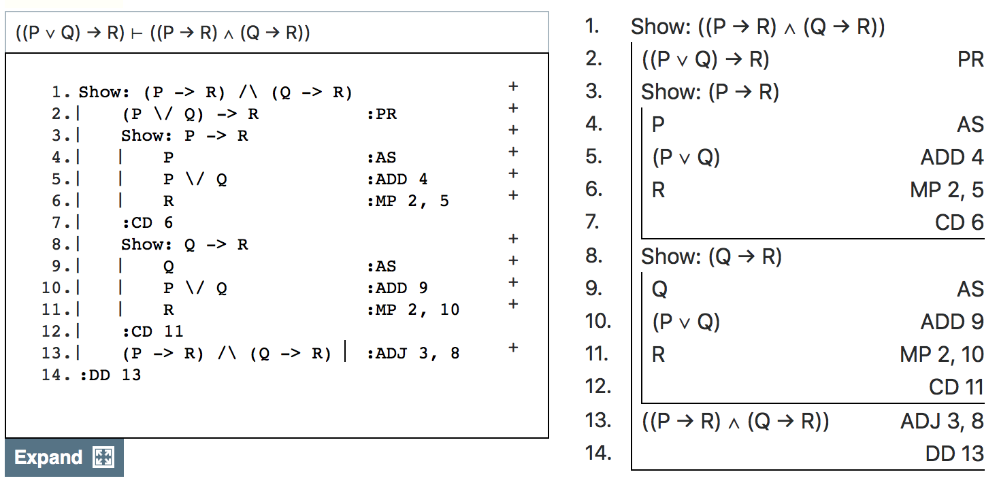
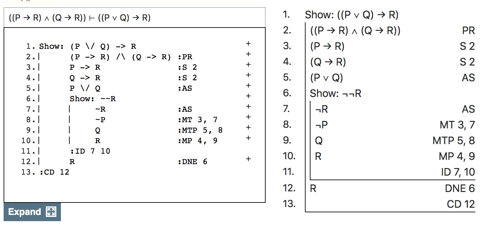

## Plan for Today

- We're going to talk about how 'or' behaves in Carnap.
- Sentences with 'or' as the main connective are called **disjunctions**, and the parts either side of the 'or' are called disjuncts.

## Associated Reading

Carnap book, chapter 8, section "Modus Tollendo Ponens and Addition" (about 1/2 way down).

## Two Rules for Or

- Like with 'and', there is a rule for proving an 'or' sentence, and a rule for using an 'or' sentence.
- The first is easy; the second is not so easy.

## Proving a Disjunction

- If you have $A$, or for that matter if you have $B$, you can infer $A \vee B$.
- The rule is called 'Addition', and abbreviated 'ADD'.
- You cite the line that $A$ (or $B$, if you are doing 'left-addition') appears on.

## Using a Disjunction

The idea here is to take the following argument as a basic valid argument.

> $P \vee Q, \neg Q \vdash P$

This is sometimes called **disjunctive syllogism**.

## Example

1. Either the butler did it or the gardener did it.
2. The gardener didn't do it.
3. So, the butler did it.

## Another Example

1. The cat raced down the left alley or the right alley.
2. The cat did not race down the right alley.
3. So, the cat raced down the left alley.

## Both Directions

This looks just as plausible a bit of reasoning.

1. Either the butler did it or the gardener did it.
2. The butler didn't do it.
3. So, the gardener did it.

It doesn't seem like whether we negate the first or second disjunct matters.

## The Rule (first version)

- Given $A \vee B$ and $\neg B$, we can infer $A$.
- The rule has a Latin name and abbreviated 'MTP'. (I'm just calling it disjunctive syllogism.)
- You cite the lines where $A \vee B$ and $\neg B$ appear.

## The Rule (second version)

- Given $A \vee B$ and $\neg A$, we can infer $B$.
- The rule has a Latin name and abbreviated 'MTP'. (I'm just calling it disjunctive syllogism.)
- You cite the lines where $A \vee B$ and $\neg A$ appear.

## Caveat

- You must have the 'positive' form in the disjunction and the negative form on a separate line.
- So the argument on the next slide will not be marked as correct by Carnap.

## Bad Use of Disjunctive Syllogism

```
6. P \/ ~Q
7. Q
8. P         :MTP 6, 7
```

## Correct Use of Disjunctive Syllogism

```
6. P \/ ~Q
7. Q
8. ~~Q       :DNI 7
9. P         :MTP 6, 8
```

## A Core Argument

The following two claims look like they should be equivalent.

1. $(P \vee Q) \rightarrow R$
2. $(P \rightarrow R) \wedge (Q \rightarrow R)$

Substitute some real sentences for $P, Q, R$ to see if this sounds right.

## Exercise

Prove each of these

> $(P \vee Q) \rightarrow R \vdash (P \rightarrow R) \wedge (Q \rightarrow R)$
> $(P \rightarrow R) \wedge (Q \rightarrow R) \vdash (P \vee Q) \rightarrow R$

## First One



## Text Version of Proof

```
1.  Show: (P -> R) /\ (Q -> R)
2.      (P \/ Q) -> R          :PR
3.     Show: P -> R
4.         P                  :AS
5.         P \/ Q             :ADD 4
6.         R                  :MP 2, 5
7.     :CD 6
8.     Show: Q -> R
9.         Q                  :AS
10.        P \/ Q             :ADD 9
11.        R                  :MP 2, 10
12.    :CD 11
13.    (P -> R) /\ (Q -> R)   :ADJ 3, 8
14. :DD 13
```

## Reverse Direction



## Text Version of Proof

```
1. Show: (P \/ Q) -> R
2.       (P -> R) /\ (Q -> R) :PR
3.       P -> R               :S 2
4.       Q -> R               :S 2
5.       P \/ Q               :AS
6.       Show: ~~R
7.            ~R              :AS
8.            ~P              :MT 3, 7
9.            Q               :MTP 5, 8
10.           R               :MP 4, 9
11.      :ID 7 10
12.      R                    :DNE 6
13. :CD 12
```


## For Next Time

We'll talk about how 'and' and 'or' interact.

