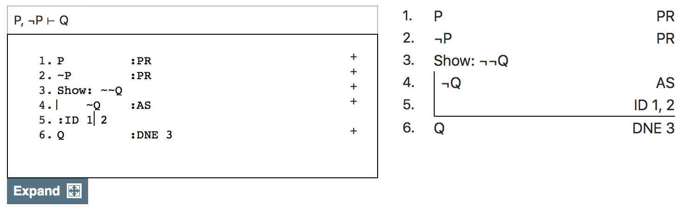
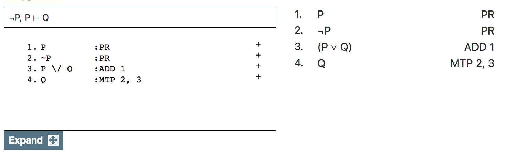
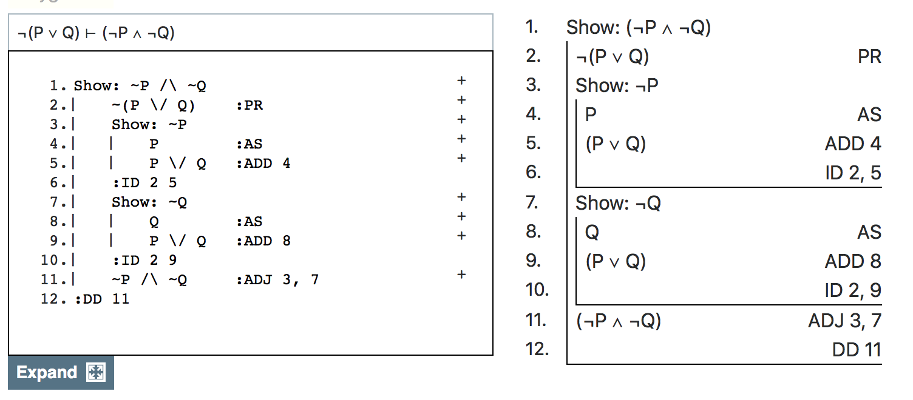
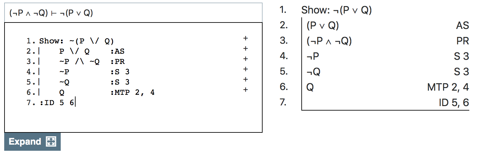
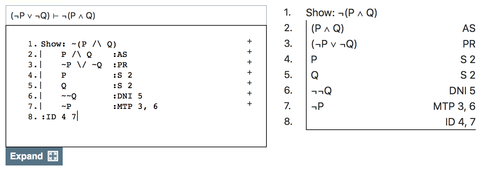
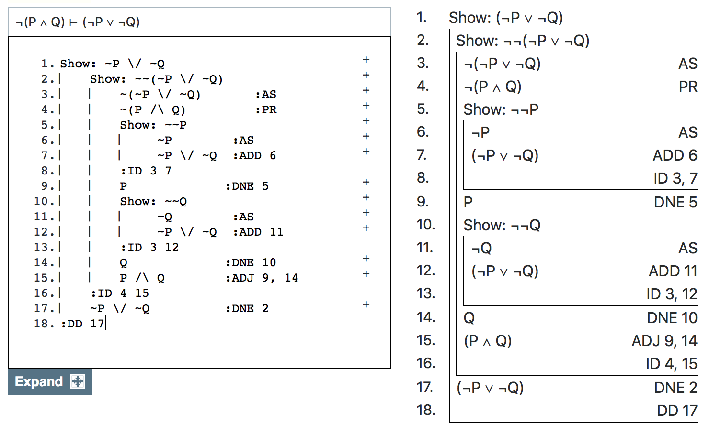

## Plan for Today

- We're going to talk two interesting consequences of the rules we've produced so far.
- The first is that the rules validate explosion, the idea that everything follows from a contradiction.
- The second is that they validate all four of what are called DeMorgan's Laws.

## Associated Reading

No associated reading, but again, this will be relevant to our later work.

# Explosion

## What It is

$P, \neg P \vdash Q$

## One Weird Thing About it

It violates **relevance** - the constraint that any valid argument should have at least some term in common between premise and conclusion.

## Informal Argument

> - An argument is valid if it is impossible for the premises to be true and the conclusion false.
> - In **Explosion**, it is impossible for the premises to be true.
> - So in **Explosion**, it is impossible for the premises to be true and the conclusion false.
> - So **Explosion** is valid.

## Formal Argument

Prove **Explosion** in Carnap.

## First Attempt

## Second Attempt

## Choice Point

1. Reject Addition
2. Reject Disjunctive Syllogism
3. Accept Explosion

> - Most people who reject explosion also reject disjunctive syllogism.

## Why Reject Explosion

> 1. Truth in a Database
> 2. Truth in a Story
> 3. There are actual true contradictions, but some things are not true.

## My View

Explosion is fine - we just have to be careful with databases and stories.

# DeMorgan Laws

## First Equivalence

1. $\neg (P \vee Q)$
2. $\neg P \wedge \neg Q$

Prove these are equivalent.

## First Direction

## Second Direction

## Second Equivalence

1. $\neg P \vee \neg Q$
2. $\neg (P \wedge Q)$

## First Direction

## Second Direction

## General Principle

To move a negation from outside the parentheses to inside it, you do two things.

1. Negate each of the parts.
2. Flip the conjunction/disjunction symbol upside down.

This process is reversible.

## For Next Time

Do the weekly assignment, and we'll start talking about truth tables.

