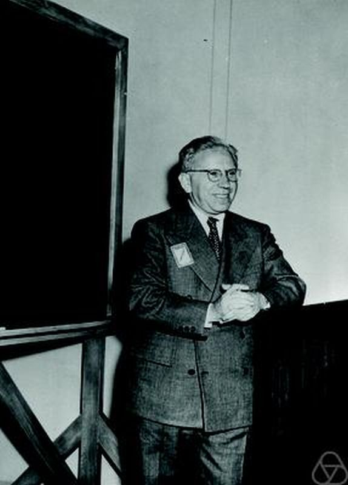
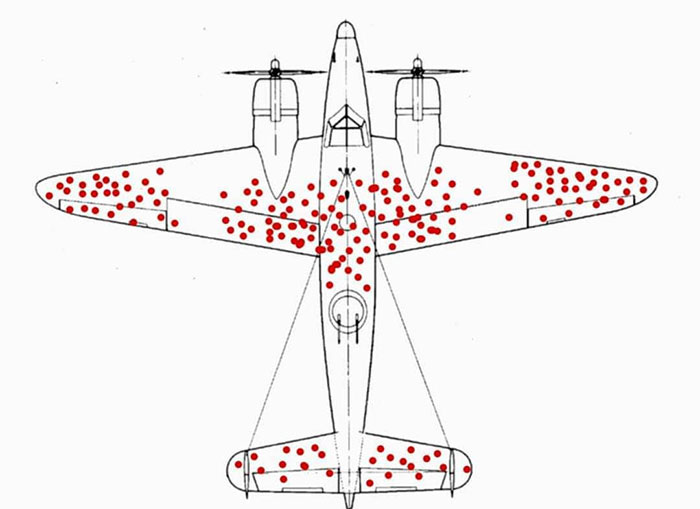

## Plan

- Today we're going to talk a bit about how to learn from uncertain data.
- We've talked a bit about the mathematics of how to update in clear cases.
- Today we're going to talk about less clear cases.
- And to do that, it helps to start with a story.

## Abraham Wald

\begincols
\begincol{.48\textwidth}

\endcol
\begincol{.48\textwidth}

We're going to do a bit of math, but we'll start with a point made by someone who was a mathematician (and a good one) that doesn't require any math. 

\endcol
\endcols

## Surviving Gunfire

- The backstory is that during WWII the Allies were losing a lot of planes to German artillery.
- They were thinking about how to add armor to the planes in order to defend them better.
- So they investigated the planes that had come back to see where they were getting most bullet holes, and planned to add extra armor to those parts.

## The Evidence

\begincols
\begincol{.48\textwidth}

\endcol
\begincol{.48\textwidth}

Here's a representation of where they found holes in the planes.

\endcol
\endcols

## Policy

\begincols
\begincol{.48\textwidth}

\endcol
\begincol{.48\textwidth}

Where should they add the armor?

\endcol
\endcols

## Wald's Answer

\begincols
\begincol{.48\textwidth}

\endcol
\begincol{.48\textwidth}

You should put the extra armor where the holes aren't.

\endcol
\endcols

## Hypothesis One - The Original Airforce View

- The planes coming back are our best sample of the planes in the field.
- The bullet holes in them are asymmetrically distributed.
- So that's evidence that certain parts of the planes are more likely to get hit.
- And that's where we should add extra protection.

## Hypothesis Two - Wald's View

- Bullet holes are almost surely randomly distributed.
- The planes coming back are not a random sample of the planes in the air.
- They do not include all of the planes that crashed.
- The best explanation of the asymmetry is that the 'missing' bullet holes are for the planes that crashed.
- And the best explantion in turn for that is that those are the places where bullet holes are fatal to the plane.

## Who Was Right

- We nowadays think Wald was.
- Artillery, especially artillery of that era, is really a random process.
- Moreover, the places with no holes - the engines and the cockpit - are just where you'd expect fatal injuries to occur.
- So the thing to do was to protect those areas, and try to turn fatal injuries into non-fatal ones.

## Big Lesson

When you see that $p$ is true, there are two different possible lessons to learn.

1. $p$ is true.
2. I'm seeing that $p$ is true.

Very often, the second is the right lesson to draw.

## Example

\begincols
\begincol{.48\textwidth}

\endcol
\begincol{.48\textwidth}

- A plane comes back with a bullethole in its left wing.
- That tells us that this plane got shot in the left wing.
- It also tells us, from the fact that we can see that this plane got shot in the left wing, that this damage is non-fatal.

\endcol
\endcols

## Big Picture

- We want to learn from our evidence.
- But sometimes that requires thinking about why we got just this evidence.
- And to do that it helps to have a theory about how to think about how evidence bears on uncertainty.

## For Next Time

We'll start looking at the mathematics of probability.